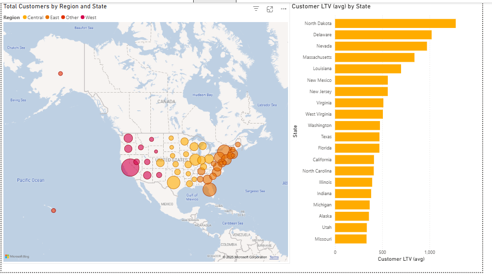
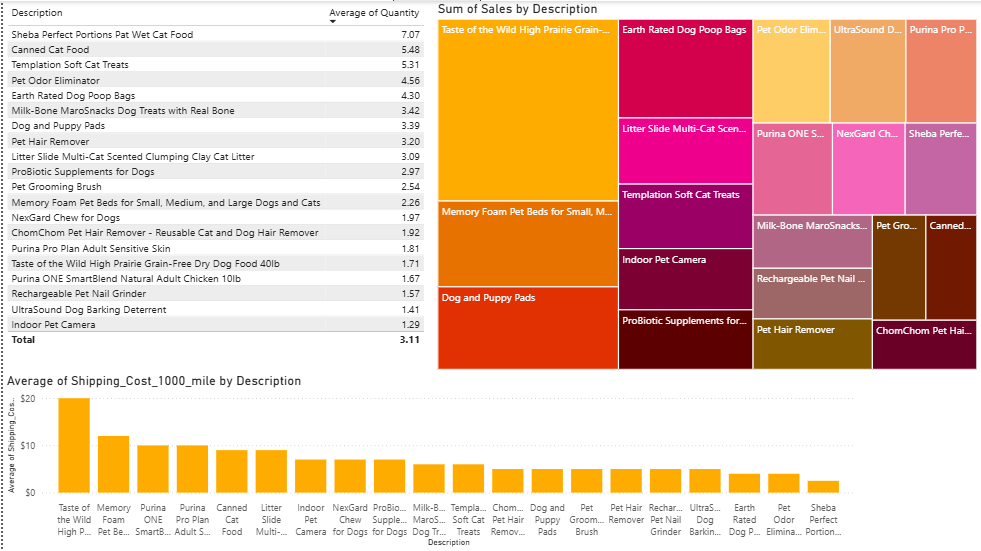
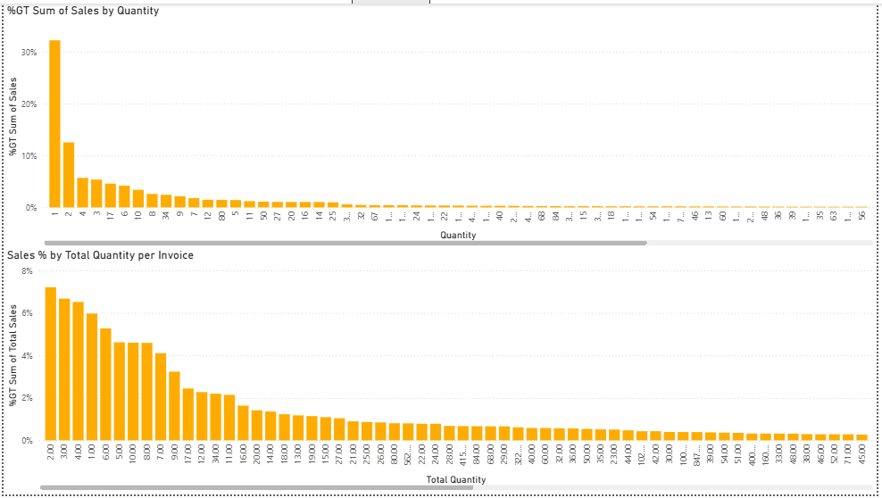
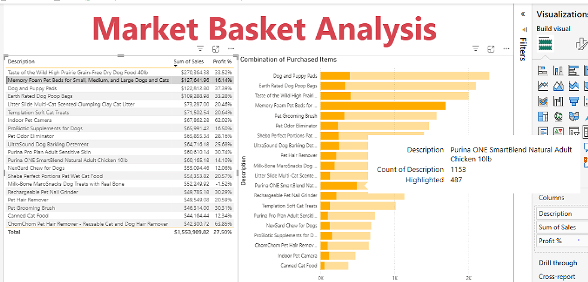
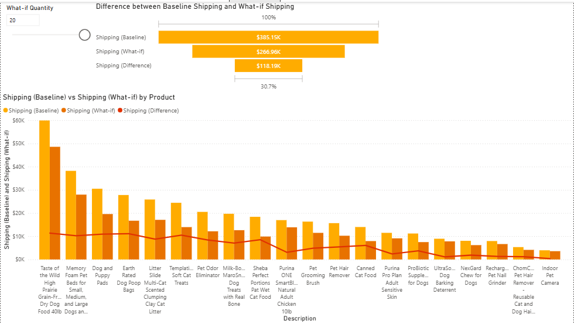
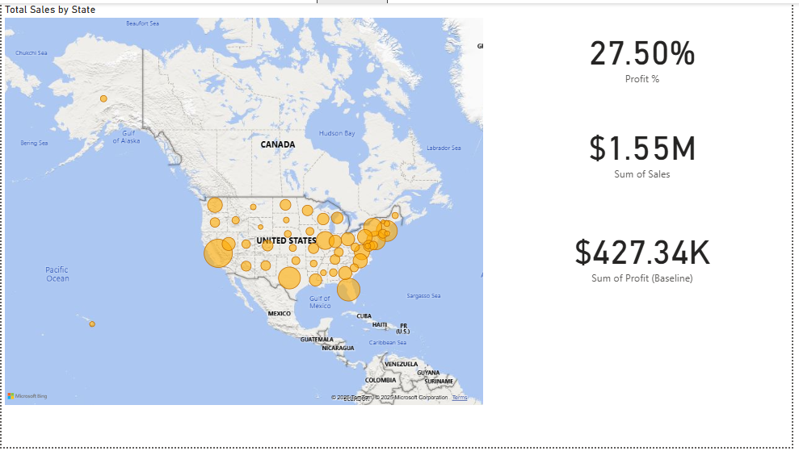
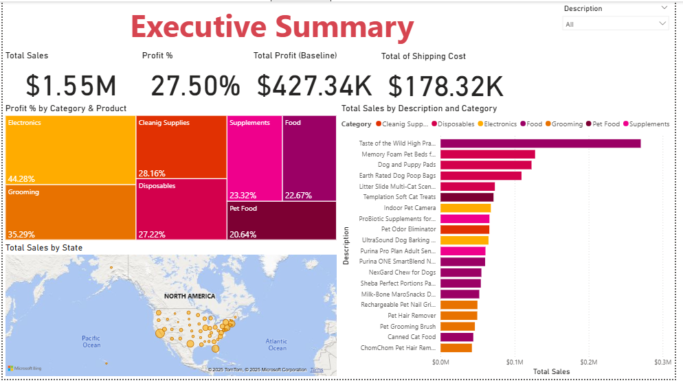
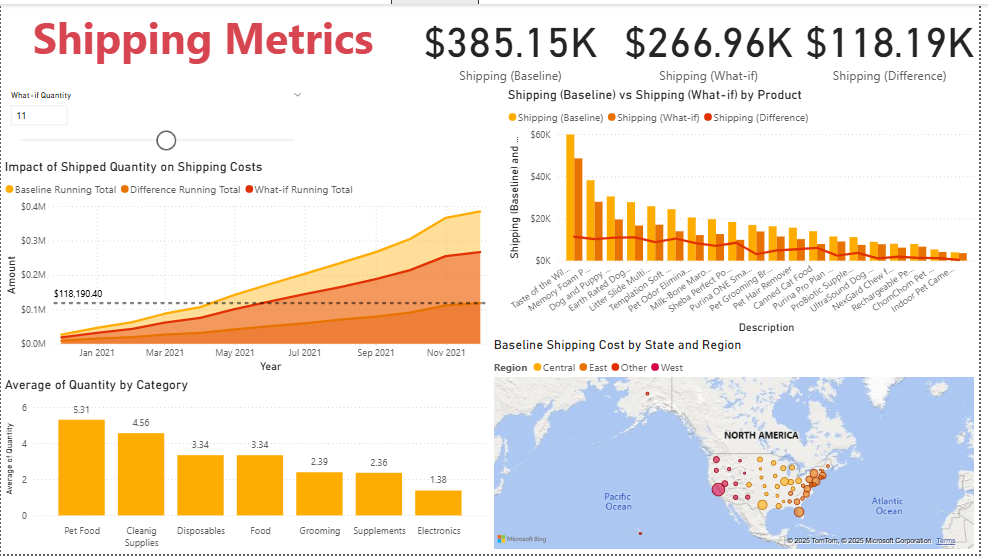
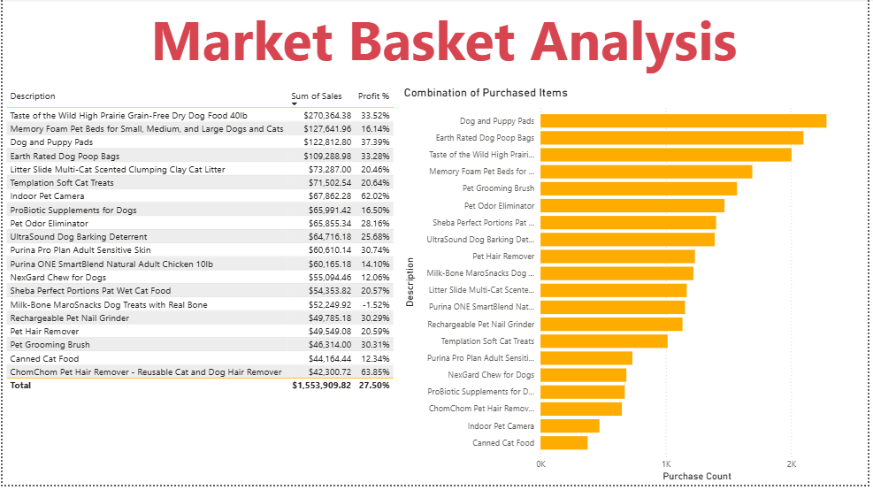

# Whiskique – Power BI Case Study

## 📌 Project Overview
Whiskique is an online pet supply company.  
This case study analyzes the company’s **overall performance** and **improvement opportunities** using data-driven insights from Power BI.

---

## 🐾 Case Study Description

### Total Cost of Canned Pet Food Through Supply Chain Stages
- **COGS (Cost of Goods Sold):** $4  
- **Landed Cost (Freight):** $1.5  
- **Fulfillment Fees (Warehouse):** $1.5  
- **Shipping Cost:** $5  
- **Profit (Loss):** $8  
- **Retail Price:** $20

### 🎯 Primary Business Goals
- Serve as many customers as possible and **increase sales**
- **Reduce operating expenses**

### 💹 Increasing Sales
Focus on **upsell** and **cross-sell** opportunities.

### 💰 Reducing Operational Costs
Shipping cost reduction strategies:
- Consolidating multiple shipments into one
- Reducing package dimensions and weight
- Shipping higher quantities per order

### 📂 Data Source
The dataset is comprised of four CSV files:
- **Sales** – Primary transactions table
- **Product** – Product details
- **Customer** – Customer information
- **State Mapping** – Consistent geographic values

---

## 🔍 Step-by-Step Analysis

### 1️⃣ Customer Analysis
  
- **Map visual** on “Customer Info” showed California had the most customers (419), followed by Florida (229).  
- **Bar chart** of top 20 states by average Lifetime Value (LTV):  
  - Highest: North Dakota ($1,277.80)  
  - Lowest: Missouri ($333.28)  
  - Note: California, despite most customers, wasn’t top 10 for LTV.

### 2️⃣ Products & Shipping
 
- **Top 3 products by avg quantity sold:**  
  1. Sheba Wet Portions Pat Wet Cat Food  
  2. Canned Cat Food  
  3. Templation Soft Cat Treats  
- **Treemap:** Highest revenue came from dog-related products, led by “Taste of the Wild High Prairie Grain-Free Dog Food 40lb” ($270,364.38 sales).  
- **Column chart:** Highest average shipping cost ($20) also for the top-selling dog food.

### 3️⃣ Quantity Insights
 
- Orders of 1 item = 32.25% of sales.  
- Most invoices had **2 items** (7.22% of total).

### 4️⃣ Market Basket Visualization
 
- Linked product relationships using many-to-many model.  
- Example: “Memory Foam Pet Beds” often bought with the top-selling dog food → cross-sell opportunity.

### 5️⃣ Shipping Costs (What-if Analysis)
 
- Modeled reduced shipping costs (70% discount per extra unit after first).  
- Showed **30.7% savings** at 10+ items; visible cost drops starting at 5 items.

### 6️⃣ Shipping Costs by Product
- **Baseline vs What-if** costs compared per product.  
- Higher quantities → lower per-unit shipping cost.

### 7️⃣ Shipping Metrics Summary
- Pet Food = highest avg quantity sold by category.  
- Electronics = lowest.  
- Mapped baseline shipping cost by region/state.

### 8️⃣ Revenue & Profits
 
- **Top 3 sales states:** California ($172,697), Florida ($107,522), Massachusetts ($88,279).  
- Total sales = $1.55M  
- Total profit = $427.34K (**27.50% margin**).

---

## 📊 Final Dashboards

### 1️⃣ Executive Summary
  
**Purpose:** High-level overview of sales, profits, shipping costs, and top products.

**Key Insights:**
- Total Sales: $1.55M (CA, FL, MA top states)
- Total Profit: $427.34K at **27.50% margin**
- Top Product: “Taste of the Wild High Prairie Grain-Free Dog Food” – $270,364 sales
- Highest Margin Category: Electronics (44.28%)

---

### 2️⃣ Shipping Metrics
  
**Purpose:** Measure impact of optimized shipping strategies.

**Key Insights:**
- Quantity-based shipping model saved **30.7%** at 10+ items.
- Pet Food = highest avg quantity sold; Electronics = lowest.
- CA & FL had highest baseline shipping costs.

---

### 3️⃣ Market Basket Analysis
  
**Purpose:** Identify cross-sell product patterns.

**Key Insights:**
- “Memory Foam Pet Beds” often bought with top-selling dog food.
- Bundling can raise **average order value**.
- High-margin accessories appear in top associated products.

---

## 🛠 Skills Used
- **Data Cleaning & Transformation:** Power Query, Excel
- **Data Modeling:** Star schema, many-to-many relationships
- **DAX:** Custom KPIs, calculated columns
- **Visualization:** Advanced Power BI visuals, slicers, maps, treemaps
- **Business Analysis:** Profitability, cost optimization, cross-selling
